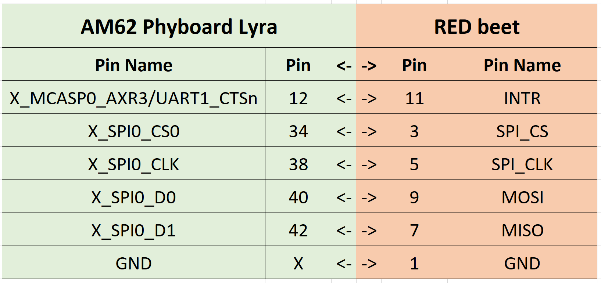

Table of Contents
=================
	1. Introduction
	2. Adding the meta-phytec_redbeet layer to your build
	3. Enabling Overlay
	4. Using PLC-Utils


1 - Introduction
==================
This repo holds the software necessary to enable and test SPI communication between the AM62/AM62A on PHYTECS Phyboard-Lyra carrier board and the PEV Automotive RED beet Carrier board EVB.

## Pin Configurtion


There are two things included in this meta-layer. The Device Tree Overlay and PLC Utils.

- **Overlay** - contains the device tree changes that we need to MUX our SPI pins on the expansion header, and to enable the driver for the RED beet.

- **PLC Utils** - The softwares used to test/verify communication between the AM62 and the RED beet. These were pre-compiled by PHYTEC to run on the AM62/AM62A ARM64 Embedded Linux.

	PLC Utils - [Source](https://github.com/qca/open-plc-utils)


2 - Adding the meta-phytec_redbeet layer to your build
======================================================

Enter the `/sources` directory of your yocto build and checkout the meta-layer

```bash
# Clone the meta-layer
git clone https://github.com/phytec-labs/meta-phytec_redbeet.git

# Add the layer to Yocto
bitbake-layers add-layer meta-phytec_redbeet'
```

You can make sure the build was successful by checking to see if `k3-am62-phyboard-lyra-redbeet.dtbo` is present on the SD cards `/boot ` partition.

3 - Enabling and Testing Overlay
=================================

Stop the boot sequence in u-boot and run the following commands to enable the device tree overlay.

```bash
=> setenv overlays k3-am62-phyboard-lyra-redbeet.dtbo
=> saveenv
```

You can now connect the RED beet to the x17 SPI expansion header pins, and begin the boot sequence.

### **!! Important !!**
You must wait and power on the RED beet after the AM62 has initiated its boot sequence or the AM62 will not boot. This can be achieved by waiting 2-3 seconds to power on the RED beet after powering on the AM62.

Once booted, we can test to see if our RED beet is connected by running the following:
``` bash 
dmesg | grep qca
```
A successful connection will look like this:
``` bash
root@phyboard-lyra-am62axx-1:~# dmesg | grep qca
qcaspi spi1.0: ver=0.2.7-i, clkspeed=8000000, burst_len=5000, pluggable=0
qcaspi spi1.0: Using random MAC address: be:1b:88:51:1e:20
qcaspi spi1.0 eth2: SPI thread created
```

4 - Using PLC-Utils
======================

1. Copy ``plc-utils`` folder onto the ``/boot`` partition of the SD Card.
2. make the local bin directory if one doesnt exist
	```
	mkdir /usr/local/bin -p
	```
3. Copy the software from ``plc-utils/bin`` into ``local/bin`` directory.
	```
	cp /boot/plc-utils/bin/* /usr/local/bin/
	```
4. Add execute permissions to our software
	```
	chmod +xwr /usr/local/bin/*
	```
5. We can now test the communication the REDbeet
	``` bash
	plctool -i eth2 -rI
	```
An example of a successfull communication:
``` bash
root@phyboard-lyra-am62axx-1:~# plctool -i eth2 -rI
eth2 00:B0:52:00:00:01 Request Version Information
eth2 C4:93:00:28:98:7F QCA7005 MAC-QCA7005-3.0.0.18-00-20200826-CS
	PIB 0-0 8836 bytes
	MAC C4:93:00:28:98:7F
	DAK CD:D2:68:DB:CA:B9:B4:46:D7:E8:03:FE:A6:4B:86:32
	NMK 50:D3:E4:93:3F:85:5B:70:40:78:4D:F8:15:AA:8D:B7 (HomePlugAV)
	NID B0:F2:E6:95:66:6B:03
	Security level 0
	NET Qualcomm Atheros Enabled Network
	MFG 8devices
	USR RED-BEET-P 1.1
	CCo Never
	MDU N/A
```
